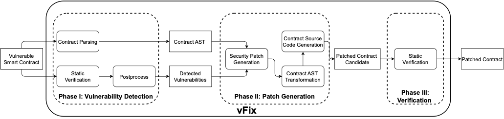

# VFIX

## Project Overview


The widespread use of smart contracts across various industries has made them an attractive target for cyberattacks, leading to substantial financial losses. As a result, continuously patching newly discovered vulnerabilities in smart contracts has become an essential maintenance task. However, addressing these vulnerabilities requires specific security expertise, which many developers lack, making the task labor-intensive without effective tool support.

To meet this critical need, we present **VFIX**, a tool that automatically generates security patches for vulnerable smart contracts. VFIX combines template-based repairs with static program analysis techniques tailored to smart contracts. Our evaluations on 144 real-world smart contracts containing different types of vulnerabilities demonstrate that VFIX can successfully patch 94% of the vulnerabilities while preserving the expected functionality of the contracts.

## Installation Guide

### 1. Install Required Static Analysis Tools
- **Securify**: Performs semantic analysis to identify security and functional issues. [GitHub Repository](https://github.com/eth-sri/securify)
- **Slither**:  Detects common vulnerabilities and provides static analysis for Solidity contracts. [GitHub Repository](https://github.com/crytic/slither)
- **Smartcheck**: A static analysis tool designed for Solidity. [GitHub Repository](https://github.com/smartdec/smartcheck)

### 2. Install Truffle and Ganache
To test the patched contracts, you’ll need to install Truffle and Ganache as follows:

- **Truffle**: A development, deployment, and testing framework for smart contracts.
  ```bash
  npm install -g truffle
  ```

- **Ganache**: A local Ethereum blockchain for testing contracts. You can download the [Ganache desktop version](https://trufflesuite.com/ganache/) or install the CLI:
  ```bash
  npm install -g ganache-cli
  ```

### 3. Install Other Dependencies
Install any remaining dependencies listed in `package-lock.json` by running:
```bash
npm install
```

## Usage Instructions

### Input
- A smart contract file with vulnerabilities
- Reports generated by static analysis tools

### Output
- The patched smart contract file

### Running the Tool
1. Run Securify, Slither, and Smartcheck on the target smart contract to generate vulnerability reports.
2. Feed these reports into VFIX, which applies relevant patches to address identified vulnerabilities.
3. The patched smart contract is output to the specified directory.


### Example Command for Running the Python Script
After converting the original JavaScript code to Python classes, you can run VFIX using the following command:
```bash
python main.py --static_reports_path <path_to_static_reports> --contract_path <path_to_contract> --output_path <path_to_output>
```

### Code Example
Below is an example of using VFIX to automatically fix vulnerabilities:

```python
from Generator import Generator

# Specify the paths to the vulnerable contract and static analysis report
contract_path = 'data/mixed/'
report_path = 'static_reports/..'

# Initialize the generator and apply fixes
generator = Generator(contract_path, report_path)
patched_contract = generator.apply_fix()

# Write the patched contract to a file
output_path = 'res/fixed_contract.sol'
with open(output_path, 'w') as f:
    f.write(patched_contract)
```
### Detailed Example: Fixing a Reentrancy Vulnerability

#### Modifications in acceptHybridization Function
In the acceptHybridization function, VFIX applies a fix to prevent reentrancy attacks by adding a reentrancy lock variable.

Original Code:

```solidity
function acceptHybridization(uint _firstUnicornId, uint _secondUnicornId) whenNotPaused public payable {
    require(unicornToken.owns(msg.sender, _secondUnicornId));
    // ...
    blackBox.geneCore.value(unicornManagement.oraclizeFee())(newUnicornId, _firstUnicornId, _secondUnicornId);
    emit CreateUnicorn(msg.sender, newUnicornId, _firstUnicornId, _secondUnicornId);
    _deleteHybridization(_firstUnicornId);
}
```

Fixed Code:
```solidity
function acceptHybridization(uint _firstUnicornId, uint _secondUnicornId) whenNotPaused public payable {
    require(lock_for_reentrancy == false);
    lock_for_reentrancy = true;
    require(unicornToken.owns(msg.sender, _secondUnicornId));
    // ...
    blackBox.geneCore.value(unicornManagement.oraclizeFee())(newUnicornId, _firstUnicornId, _secondUnicornId);
    emit CreateUnicorn(msg.sender, newUnicornId, _firstUnicornId, _secondUnicornId);
    _deleteHybridization(_firstUnicornId);
    lock_for_reentrancy = false;
}

```

Explanation: The line require(lock_for_reentrancy == false); ensures no reentrant call is currently executing. The lock_for_reentrancy variable is then set to true, blocking any reentrant call during the function's execution. Once the operation completes, it is reset to false, allowing other calls. This sequence effectively mitigates reentrancy attacks by preventing simultaneous re-entry.


#### Modification in createUnicornForCandy Function
A similar modification is applied to the createUnicornForCandy function to prevent reentrancy attacks.

Original Code:

```solidity
function createUnicornForCandy() public payable whenNotPaused returns(uint256) {
    require(msg.value == unicornManagement.oraclizeFee());
    require(candyToken.transferFrom(msg.sender, this, getCreateUnicornPriceInCandy()));
    return _createUnicorn(msg.sender);
}
```

Fixed Code:
```solidity
function createUnicornForCandy() whenNotPaused public payable returns(uint256) {
    require(lock_for_reentrancy == false);
    lock_for_reentrancy = true;
    require(msg.value == unicornManagement.oraclizeFee());
    require(candyToken.transferFrom(msg.sender, this, getCreateUnicornPriceInCandy()));
    uint256 newUnicornId = _createUnicorn(msg.sender);
    lock_for_reentrancy = false;
    return newUnicornId;
}
```
Explanation: Similar to acceptHybridization, this function includes a lock_for_reentrancy check. By setting lock_for_reentrancy = true; at the start of execution, it prevents reentrant attacks, ensuring the function's secure operation.


The generated `.sol` file contains the patched contract code. For example, for a reentrancy vulnerability, the patched code will update state variables before external calls to prevent reentrancy attacks.

## Examples and Results
The `examples` folder contains sample contracts with vulnerabilities that can be used as input for VFIX, and the `res` folder includes the corresponding patched contracts, demonstrating the tool’s effectiveness across various vulnerability types.
